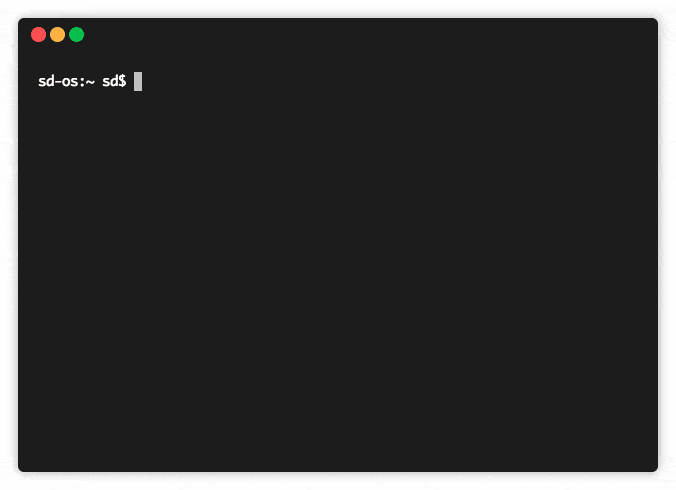

# terminal velocity

A command line note-taking interface combining elements of [Notational Velocity](http://notational.net/) and [nvALT](http://brettterpstra.com/projects/nvalt/)

*This package is in early development. Please file an issue if/when you find a bug.*

## Description
From Notational Velocity:

> NOTATIONAL VELOCITY is an application that stores and retrieves notes. It is an attempt to loosen the mental blockages to recording information and to scrape away the tartar of convention that handicaps its retrieval. The solution is by nature nonconformist.



## Installation

```npm install -g termv```

## Usage
Once installed, simply run ```termv``` in your console

## Current Features

1. **Modeless Operation**
	* Searching for a note and creating a new note are done through the same interface
2. **Incremental Search**
	* Searching encompasses all notes' content and occurs instantly with each key pressed

## Future Features
1. **Encryption**
	* All content is compressed and encrypted (enabled optionally) before it is recorded to disk.
2. **Linking**
	* Words between [[double-brackets]] will become links to other notes
3. **Show in Finder**
	* Command for revealing selected note-files on disk
4. **Open in external text editor**